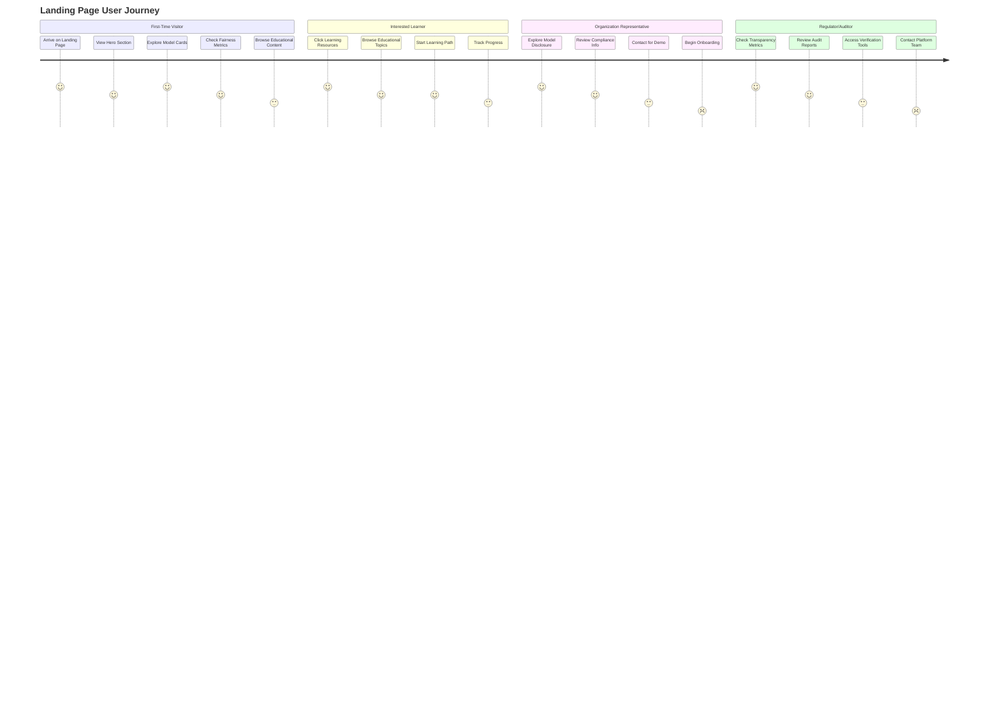
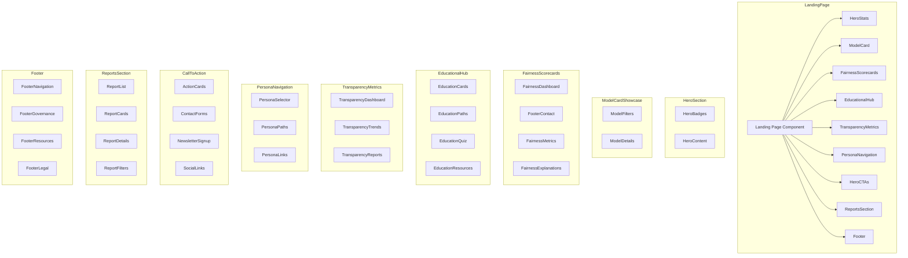
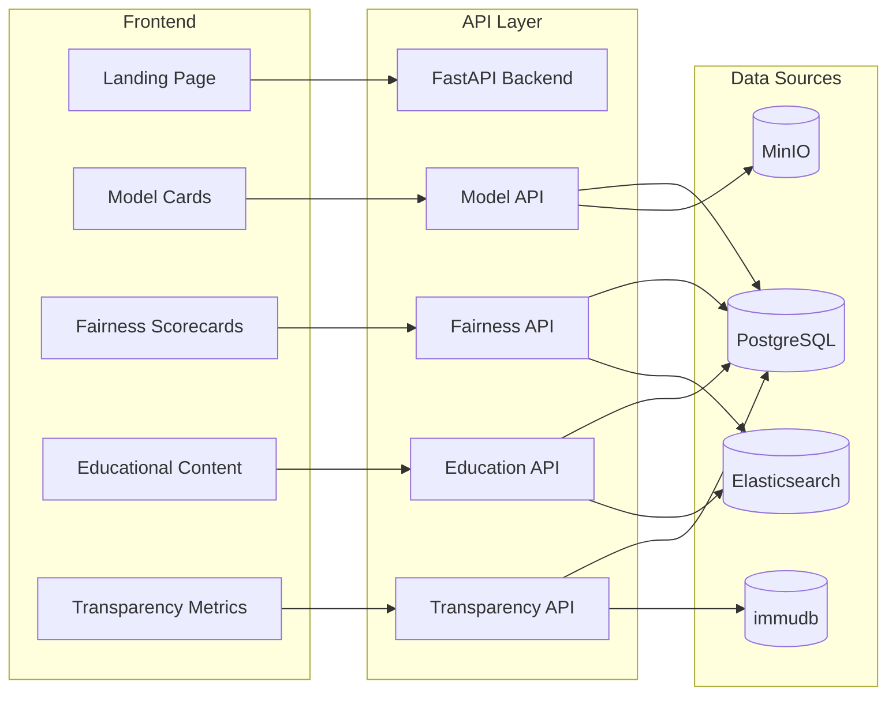
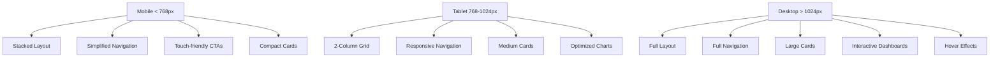
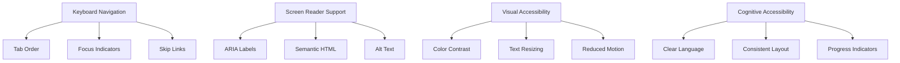

# Landing Page Architecture - Visual Overview

## Page Structure Diagram

```mermaid
graph TD
    A[Hero Section] --> B[Navigation Bar]
    A --> C[Featured Model Cards]
    A --> D[Fairness Scorecards]
    A --> E[Educational Content Hub]
    A --> F[Transparency Metrics Dashboard]
    A --> G[Persona Navigation]
    A --> H[Call-to-Action Sections]
    A --> I[Recent Reports]
    A --> J[Comprehensive Footer]
    
    B --> K[Model Owners]
    B --> L[Risk & Governance]
    B --> M[Auditors]
    B --> N[Regulators]
    B --> O[Public/Users]
    B --> P[Learners]
    
    C --> Q[Model Card 1]
    C --> R[Model Card 2]
    C --> S[Model Card 3]
    C --> T[View All Models]
    
    D --> U[Demographic Parity]
    D --> V[Equal Opportunity]
    D --> W[Disparate Impact]
    D --> X[Feature Importance]
    
    E --> Y[Fairness 101]
    E --> Z[Explainability Guide]
    E --> AA[Recourse Process]
    E --> BB[Model Card Tutorial]
    
    F --> CC[Models Disclosed]
    F --> DD[Fairness Scores]
    F --> EE[Compliance Rates]
    F --> FF[Audit Completion]
    
    G --> GG[Model Owner Path]
    G --> HH[Risk Manager Path]
    G --> II[Auditor Path]
    G --> JJ[Regulator Path]
    G --> KK[Public Path]
    G --> LL[Learner Path]
    
    H --> MM[Disclose Your Model]
    H --> NN[Start Learning]
    H --> OO[Request Audit]
    H --> PP[Join Community]
    
    I --> QQ[Q1 2024 Report]
    I --> RR[Q4 2023 Report]
    I --> SS[Incident Reports]
    I --> TT[All Reports]
    
    J --> UU[Platform Navigation]
    J --> VV[Governance Links]
    J --> WW[Resources]
    J --> XX[Legal]
    J --> YY[Contact]
```

## User Flow Diagram

## Component Hierarchy

## Data Flow Architecture

## Responsive Design Breakpoints

## Accessibility Features Map

This architecture provides a comprehensive overview of how the enhanced landing page will be structured, how users will interact with it, and how the various components will work together to create a cohesive experience focused on AI transparency and education.