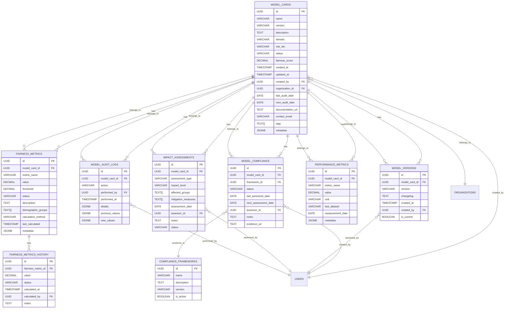

# Model Card System Architecture

## Database Schema Visualization

## API Layer Architecture

## Frontend Component Architecture

## Data Flow Architecture

## Security and Access Control Architecture

## Search and Filtering Architecture

This architecture provides a comprehensive overview of how the Model Card system will be structured, from the database layer through to the frontend components. It ensures proper separation of concerns, scalability, and maintainability while supporting the complex requirements of AI model transparency and fairness tracking.