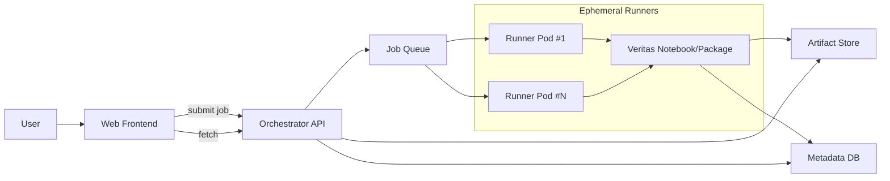

# Technical Design Specification

Transform Veritas Jupyter Tools into a Web Application (No Code)

---

## 0. Purpose
Enable non‑technical users to run two open‑source Veritas tools via a website and produce regulator‑ready artifacts:
1. Fairness Assessment Toolkit
2. Diagnosis / Explainability Toolkit

Outputs include interactive dashboards, Model Cards, and compliance evidence packs.

Non‑goals: change methodologies; rewrite notebooks; offer real‑time inference.

---

## 1. Scope
**In‑scope**
- Web upload and connector‑based data/model ingestion.
- Parameterised, headless execution of the original notebooks/packages.
- Storage of artifacts (JSON metrics, plots, HTML/PDF reports, Model Cards).
- RBAC, approvals, audit logging, data retention.
- CI/CD, observability, version pinning and reproducibility.

**Out‑of‑scope**
- Altering Veritas metrics/thresholds.
- Building a full MLOps platform.
- Streaming/real‑time scoring.

---

## 2. Users & Roles
- **Owner (Model Team):** upload data/models, configure runs, view results, request publish.
- **Reviewer (Risk/Compliance):** review runs, add notes, approve/decline publishing.
- **Viewer (Business/Regulator):** read‑only access to approved artifacts.

---

## 3. Functional Requirements
### 3.1 Data & Model Ingestion
- Upload formats: CSV, Parquet; optional model objects (pickle/ONNX) when supported.
- Connectors: S3/Azure Blob/SharePoint (read‑only service principals).
- Schema assist: preview, type inference, protected attribute selection, target/score mapping.

### 3.2 Configuration Wizards
- **Fairness:** protected attributes, reference/privileged groups, thresholds, subgroup rules.
- **Diagnosis:** performance metrics, drift checks, explainability if exposed by upstream tool.
- Save/load **Assessment Recipes** (versioned parameter sets).

### 3.3 Execution
- Submit job → receive job ID → poll status → cancel on quota/timeout.
- Concurrency and quotas per tenant.

### 3.4 Results & Artifacts
- Dashboards: parity metrics, subgroup breakdowns, pass/fail flags, narrative summaries.
- Machine‑readable JSON: metrics, parameters, timestamps, data hashes.
- Human‑readable HTML/PDF: full report.
- Evidence pack (ZIP): JSON + images + execution manifest.

### 3.5 Model Cards
- Assembled from run JSON + user context (intended use, scope, limitations, human‑in‑loop).
- Versioned per **model version × dataset snapshot**; changelog retained.

### 3.6 Governance Workflow
- Reviewer approval required for high‑materiality use cases before publishing cards.
- Immutable audit trail for all actions.

---

## 4. Non‑Functional Requirements
- **Security:** TLS, encryption at rest, secrets in vault, network isolation.
- **Privacy:** optional PII scanner, masking, configurable retention.
- **Scalability:** horizontal scaling of runners; autoscaling by queue depth.
- **Reliability:** retries with backoff; idempotent job handling.
- **Observability:** metrics, logs, traces, alerts.
- **Reproducibility:** pinned container images; execution manifests.

---

## 5. High‑Level Architecture

**Notes**
- One job = one ephemeral container (isolation, reproducibility).
- Runners execute the upstream notebooks/packages headlessly and write artifacts.

---

## 6. Component Design
### 6.1 Frontend (Website)
- Forms: data/model selection, schema mapping, run parameters.
- Views: job status, dashboards, side‑by‑side run diffs, publish flow, downloads.

### 6.2 Orchestrator API (Contract‑level)
- `POST /jobs` → create job (payload: data source, schema_map, params, tool=diagnosis|assessment).
- `GET /jobs/{id}` → status, summary, errors.
- `GET /jobs/{id}/artifacts` → signed URLs to artifacts.
- `POST /cards` → build/publish a model card from a completed job.
- `GET /cards/{id}` → fetch card metadata and links.
- `POST /approvals/{id}` → reviewer approve/decline with notes.

Responsibilities: validate payloads, generate presigned upload URLs, enqueue jobs, enforce quotas, sign artifact links.

### 6.3 Notebook Execution Layer
- Container images per tool with pinned OS + Python + package versions.
- Runner strategy: start container → fetch inputs → execute → write artifacts → exit.
- Execution modes: papermill/nbclient for parameterised notebooks, or direct package APIs when available.

### 6.4 Artifact Store
- Layout:
  - `/tenants/{tenant}/jobs/{jobId}/json/metrics.json`
  - `/tenants/{tenant}/jobs/{jobId}/reports/report.html|pdf`
  - `/tenants/{tenant}/jobs/{jobId}/manifests/exec.json`
  - `/tenants/{tenant}/jobs/{jobId}/images/*`

### 6.5 Metadata DB (Entities)
- Tenant, User, DataSource, Job, RunConfig, MetricsSummary, Card, Approval, AuditEvent.
- Indexes by tenant, model name/version, status, created_at.

---

## 7. Data Contracts
### 7.1 Job Submission (Request)
- `tool`: `diagnosis` | `assessment`
- `data_source`: `upload` or connector reference
- `schema_map`: feature columns, target/score column, protected attributes, reference groups
- `params`: metric set, thresholds, subgroup rules, random seed
- `labels`: model_name, model_version, dataset_version, business_owner

### 7.2 Metrics Summary (Output)
- `run_id`, `tool_version`, `container_digest`, `started_at`, `ended_at`
- `global_metrics`: accuracy/precision/recall/AUC (if produced by upstream)
- `fairness_metrics`: per subgroup, parity gaps, pass/fail
- `notes`: caveats, warnings, missing attributes
- `artifacts`: links to HTML/PDF/ZIP

(Keep keys aligned with upstream outputs to avoid divergence.)

---

## 8. Execution Flow
1. User selects tool and uploads/connects data.
2. Schema mapping and config wizard complete; API validates payload.
3. API enqueues job; runner container spins up and executes notebook/package.
4. Runner writes JSON metrics, plots, reports, manifest to artifact store.
5. API updates job status; frontend refreshes status and renders dashboard.
6. Owner requests publish; Reviewer approves; Model Card generated and listed.

---

## 9. Security & Privacy
- Private VPC; runners have no outbound Internet except allow‑listed registries.
- Secrets in vault; presigned URLs for uploads/downloads; short TTL.
- Encryption at rest and in transit.
- Retention defaults: raw uploads 7–30 days; derived metrics 1–3 years.
- Optional PII scanner; masking rules; sampling guidance for large files.

---

## 10. RBAC, Audit, Approvals
- Roles: Owner, Reviewer, Viewer.
- Approval required for high‑materiality cards; notes recorded.
- Audit events: user, action, payload hash, timestamp, outcome; immutable storage.

---

## 11. Observability
- Metrics: queue depth, run time, success/failure, artifact sizes, per‑tool latency.
- Logs: structured with correlation IDs (tenant, jobId, runId).
- Traces: API → queue → runner → store.
- Alerts: job failure rate, runner crash loops, artifact write errors, SLO breaches.

---

## 12. Performance & Scaling Targets
- Concurrency caps per tenant; fair‑share scheduling.
- Large dataset handling: server‑side sampling; row/column caps; early schema validation.
- Autoscaling: based on queue length and CPU usage.
- Example target: P50 job ≤ 10 min for 5M rows after sampling; P95 ≤ 30 min.

---

## 13. CI/CD & Versioning
- Immutable base images per tool; semver tags; monthly refresh cadence.
- Regression tests on golden datasets; assert JSON metric snapshots.
- Blue/green deploy for API and frontend.

---

## 14. Compliance Artifacts
- FEAT evidence pack (narrative + metrics + governance prompts).
- EU AI Act technical documentation bundle where applicable.
- Model Card (HTML/PDF) with versioning and changelog.

---

## 15. Operational Runbooks
- Job stuck/failed: retry rules, escalation, quota checks.
- Data policy violations: auto‑reject with user guidance.
- Artifact corruption: re‑run from manifest; compare hashes.

---

## 16. Deployment Topology Options
- **AWS:** ALB + ECS/EKS runners + SQS + S3 + RDS/Aurora + Secrets Manager + CloudWatch.
- **Azure:** Front Door/App Service + AKS runners + Storage Queue + Blob + SQL DB + Key Vault + Monitor.
- **GCP:** Cloud Run/GKE + Pub/Sub + GCS + Cloud SQL + Secret Manager + Cloud Monitoring.

Choose one stack end‑to‑end for simplicity and supportability.

---

## 17. Risks & Mitigations
- Large files → long runs: enforce limits, sampling, ETAs; allow offline/batch window.
- Missing protected attributes: provide alternative fairness strategies; document limitations on cards.
- Notebook fragility: freeze deps, integration tests, canary images.
- User schema errors: validators, previews, step‑wise wizard.

---

## 18. Deliverables & Milestones
- **M0 (Week 0–1):** Finalise requirements; pick cloud stack; risk taxonomy.
- **M1 (Week 2–3):** Base images; orchestrator contracts; artifact schema.
- **M2 (Week 4–5):** Runner pipeline; queues; basic UI for upload/config/status.
- **M3 (Week 6–7):** Dashboards; JSON/PDF artifacts; approvals; audit logging.
- **M4 (Week 8–9):** Model Card generator; publishing; RBAC.
- **M5 (Week 10–12):** Hardening: security, observability, DR, SLOs.

---

## 19. Acceptance Criteria (UAT)
- A non‑technical user completes an end‑to‑end run without help.
- Evidence pack downloads with all expected files and hashes.
- Reviewer can approve/decline and leave notes; audit reflects actions.
- Model Card renders with correct metadata and links; versioning works.

---

## 20. Appendix
**Glossary:**
- Assessment Recipe: saved parameter set for repeatable runs.
- Execution Manifest: JSON containing tool version, container digest, parameters, input hashes.
- Evidence Pack: ZIP of JSON metrics, plots, reports, and manifest.

**References (high‑level):**
- Veritas Diagnosis Tool (Jupyter/Python)
- Veritas Fairness/Assessment Toolkit (Jupyter)
- FEAT Principles (Fairness, Ethics, Accountability, Transparency)

